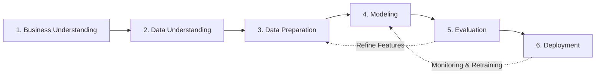

# 🏢 US Apartment Rent Prediction (CRISP-DM)

[](https://www.python.org/)
[](https://streamlit.io/)
[](https://scikit-learn.org/)
[](https://mlflow.org/)
[](LICENSE)

**BMDS2003 Data Science Project — Group 4**

An end-to-end data science regression project that predicts monthly apartment rental prices (USD) across the United States. Following the standard **CRISP-DM** methodology, this repository covers everything from raw data ingestion, exploratory data analysis, and advanced feature engineering to training 4 machine learning models, logging experiments with MLflow, and deploying a modern interactive **Streamlit web application**.

---

## 📑 Table of Contents

- [Project Overview](#-project-overview)
- [Repository Architecture](#-repository-architecture)
- [Zero-to-One Quickstart Guide](#-zero-to-one-quickstart-guide)
  - [Prerequisites](#1-prerequisites)
  - [Step 1: Clone Repository & Navigate](#step-1-clone-repository--navigate)
  - [Step 2: Environment Setup & Installation](#step-2-environment-setup--installation)
  - [Step 3: Launch the Streamlit Web App](#step-3-launch-the-streamlit-web-app)
  - [Step 4: Run / Retrain Models with MLflow Pipeline](#step-4-run--retrain-models-with-mlflow-pipeline)
  - [Step 5: Run the Full CRISP-DM Notebook](#step-5-run-the-full-crisp-dm-notebook)
- [MLflow Experiment Tracking & Model Registry Guide](#-mlflow-experiment-tracking--model-registry-guide)
- [CRISP-DM Workflow Breakdown](#-crisp-dm-workflow-breakdown)
- [Model Performance Benchmark](#-model-performance-benchmark)
- [Streamlit Dashboard Features](#-streamlit-dashboard-features)
- [Troubleshooting & FAQs](#-troubleshooting--faqs)
- [Team & Acknowledgements](#-team--acknowledgements)

---

## 🌟 Project Overview

- **Dataset**: UCI *Apartment for Rent Classified* (100K subset, 22 raw columns, semicolon delimited, `cp1252` encoding).
- **Core Problem**: Estimating fair market monthly rental rates across 50 US states with high non-linearity, extreme geographic variation, and unstructured amenities data.
- **Key Techniques**:
  - **Data Cleaning & Filtering**: IQR-based outlier thresholding ($k = 3.0$) on price and square footage.
  - **Feature Engineering**: NLP parsing of 12 distinct luxury amenities, amenity counting, space allocation ratios (`sqft_per_bedroom`, `sqft_per_bathroom`, `bed_bath_ratio`), and out-of-fold target encoding (`city_median_price`).
  - **Data Transformation**: Target log transformation ($\log(1 + y)$) to normalize right-skewed residuals + `StandardScaler` normalization.
  - **Algorithms Evaluated**: Linear Regression (Baseline), Decision Tree Regressor, Random Forest Regressor, and Hist Gradient Boosting Regressor.
  - **Deployment**: Interactive valuation dashboard built on Streamlit with multi-model consensus, dynamic geolocation autofill, and confidence intervals.

---

## 📂 Repository Architecture

```text
RDS-Data_Science_Assignment/
│
├── BMDS2003_Group4_notebook.ipynb            # Comprehensive CRISP-DM Jupyter Notebook (EDA → Models → Evaluation)
├── apartments_for_rent_classified_100K.csv   # Raw UCI dataset (100K records, ';' delimited, cp1252)
├── requirements.txt                          # Top-level dependencies for the entire project
├── README.md                                 # Complete zero-to-one project documentation
├── .gitignore                                # Git ignore rules (virtual environments, cache, models)
├── .gitattributes                            # Normalization rules for repo line endings & binaries
│
├── mlflow.db                                 # SQLite database storing MLflow experiment tracking & model registry
├── mlruns/                                   # MLflow artifact storage (contains all 4 model binaries & metadata)
├── eda_graphs/                               # Visualizations generated during Phase 2 (EDA)
│   ├── eda_price_hist.png                    # Distribution of monthly rent (right-skewed)
│   ├── eda_boxplots.png                      # Boxplots of rent & square feet (IQR justification)
│   ├── eda_correlation.png                   # Feature correlation heatmap
│   ├── eda_price_vs_sqft.png                 # Scatter plot: Price vs. Square Footage
│   └── eda_rent_by_state.png                 # Top 15 states by listing count & average rent
│
├── model_graphs/                             # Diagnostic & validation plots for all 4 models
│   ├── m1_pred_vs_actual.png                 # Model 1 (Linear): Predicted vs. Actual
│   ├── m1_residual_plot.png                  # Model 1 (Linear): Residuals vs. Predicted
│   ├── m1_residual_hist.png                  # Model 1 (Linear): Residual distribution
│   ├── m2_validation_curve.png               # Model 2 (Decision Tree): Train/Test R² vs. Depth
│   ├── m2_feature_importance.png             # Model 2 (Decision Tree): Gini importance
│   ├── m2_mae_by_tier.png                    # Model 2 (Decision Tree): MAE across rent tiers
│   ├── m3_feature_importance.png             # Model 3 (Random Forest): Top predictive drivers
│   ├── m3_residual_by_bedroom.png            # Model 3 (Random Forest): Error grouped by bedrooms
│   ├── m3_hexbin.png                         # Model 3 (Random Forest): Hexbin density plot
│   ├── m4_learning_curve.png                 # Model 4 (Hist Gradient Boosting): Learning curve
│   ├── m4_residual_plot.png                  # Model 4 (Hist Gradient Boosting): Residuals
│   └── m4_abs_error_hist.png                 # Model 4 (Hist Gradient Boosting): Absolute errors
│
└── streamlit/                                # Interactive Deployment Dashboard & Pipeline
    ├── app.py                                # Main Streamlit web app (loads models via MLflow Registry)
    ├── train_model.py                        # Automated MLflow training, registration & artifact export pipeline
    ├── requirements.txt                      # App-specific dependencies
    ├── README.md                             # Streamlit sub-module guide
    ├── mlflow_run_map.joblib                 # Mapping connecting Streamlit UI to active MLflow Model Run IDs
    ├── scaler.joblib                         # Trained StandardScaler instance
    ├── num_cols.joblib                       # Continuous feature schema
    ├── model_columns.joblib                  # One-hot aligned column layout
    ├── state_geo.joblib                      # Per-state median latitude/longitude coordinates
    ├── city_geo.joblib                       # Per-city metadata (medians, state, coordinates)
    └── model_metrics.joblib                  # Serialized evaluation metrics for UI consensus
```

---

## 🚀 Zero-to-One Quickstart Guide

Follow these sequential steps to go from a clean machine to a running web application and research environment.

### 1. Prerequisites

Ensure you have the following installed on your system:
- **Python**: Version `3.9`, `3.10`, `3.11`, or `3.12` ([Download Python](https://www.python.org/downloads/))
- **Git**: [Download Git](https://git-scm.com/)
- **Conda** *(Optional)*: Anaconda or Miniconda ([Download Conda](https://docs.conda.io/en/latest/miniconda.html))

---

### Step 1: Clone Repository & Navigate

Open your terminal or command prompt and clone the repository:

```bash
git clone https://github.com/ZeoLeezh/RDS-Data_Science_Assignment.git
cd RDS-Data_Science_Assignment
```

Verify that the dataset file `apartments_for_rent_classified_100K.csv` is located in the project root directory (~100 MB).

---

### Step 2: Environment Setup & Installation

We recommend creating an isolated virtual environment to avoid dependency conflicts.

#### Option A: Using Standard Python `venv` (Recommended)

**macOS / Linux:**
```bash
# 1. Create a virtual environment named .venv
python3 -m venv .venv

# 2. Activate the virtual environment
source .venv/bin/activate

# 3. Upgrade pip
pip install --upgrade pip

# 4. Install all required dependencies
pip install -r requirements.txt
```

**Windows (Command Prompt / PowerShell):**
```cmd
:: 1. Create virtual environment
python -m venv .venv

:: 2. Activate virtual environment (Command Prompt)
.venv\Scripts\activate

:: Or in PowerShell:
:: .venv\Scripts\Activate.ps1

:: 3. Upgrade pip & install dependencies
python -m pip install --upgrade pip
pip install -r requirements.txt
```

#### Option B: Using Conda

```bash
# 1. Create a conda environment
conda create -n rent_prediction python=3.10 -y

# 2. Activate environment
conda activate rent_prediction

# 3. Install packages
pip install -r requirements.txt
```

---

### Step 3: Launch the Streamlit Web App

The repository includes pre-trained `.joblib` model binaries, allowing you to launch the web dashboard immediately without retraining:

```bash
# From the project root directory:
streamlit run streamlit/app.py
```

*Alternatively, run from within the `streamlit/` folder:*
```bash
cd streamlit
streamlit run app.py
```

The application will launch in your default web browser at:
👉 **`http://localhost:8501`**

#### 💡 Using the Web Dashboard:
1. **Choose Model**: Select between *Gradient Boosting (Recommended)*, *Random Forest Ensemble*, *Decision Tree*, or *Linear Baseline*.
2. **Set Location**: Pick any US **State** and **City** (automatically pulls live median pricing and coordinates).
3. **Configure Space**: Adjust square footage, bedroom count, and bathroom count.
4. **Select Amenities**: Toggle in-unit washer/dryer, dishwasher, pool, fitness center, AC, garage, etc.
5. **View Results**: Instantly inspect fair market rent, $\pm 10\%$ confidence interval, price/sq.ft rate, and cross-algorithm valuation consensus.

---

### Step 4: Run / Retrain Models with MLflow Pipeline

To retrain all 4 machine learning models from scratch, recalculate scaling parameters, log experiment runs to MLflow, and regenerate all `.joblib` artifacts:

```bash
# Run training script from project root
python streamlit/train_model.py
```

#### Inspect Experiments with MLflow UI:
The training script automatically logs all hyperparameters, evaluation metrics (MAE, RMSE, MAPE, $R^2$, Within $\pm 10\%$, Within $\pm 20\%$) to a local SQLite database (`mlflow.db`).

To open the interactive MLflow tracking dashboard:
```bash
mlflow ui --backend-store-uri sqlite:///mlflow.db
```
Open **`http://localhost:5000`** in your browser to compare training runs, metrics, and logs.

---

### Step 5: Run the Full CRISP-DM Notebook

If you want to step through the exploratory data analysis, hypothesis testing, diagnostic plotting, and model evaluations:

#### Option A: Local Jupyter Notebook
```bash
# Start Jupyter
jupyter notebook

# In the browser tree, click to open:
# BMDS2003_Group4_notebook.ipynb
```
Select **Cell → Run All** to execute all steps sequentially.

#### Option B: Google Colab (Cloud, Zero-Install)
1. Navigate to [Google Colab](https://colab.research.google.com/).
2. Click **File → Upload notebook** and select `BMDS2003_Group4_notebook.ipynb`.
---

## 🔬 MLflow Experiment Tracking & Model Registry Guide

MLflow is integrated into this project to manage the complete model lifecycle: experiment comparison, metric tracking, hyperparameter logging, model artifact storage, and model versioning.

### 1. Start the MLflow UI Server

To launch the MLflow web dashboard from your project root:

```bash
# Start MLflow pointing to the project's SQLite database
mlflow ui --backend-store-uri sqlite:///mlflow.db
```

*To run on a custom port (e.g. 5001) if port 5000 is occupied:*
```bash
mlflow ui --backend-store-uri sqlite:///mlflow.db --port 5001
```

Once started, open your browser and navigate to:
👉 **`http://localhost:5000`**

---

### 2. How to View Experiments & Compare Runs

1. **Select Experiment**: In the left sidebar under **Experiments**, click on **`Apartment_Rent_Prediction`**.
2. **View Run History**: You will see all recorded training runs:
   - `Production_Hist Gradient Boosting (Tuned)`
   - `Production_Random Forest (100 Trees)`
   - `Production_Decision Tree (Tuned)`
   - `Production_Linear Regression (Baseline)`
   - `Production_Metadata_Preprocessors`
3. **Compare Models**:
   - Check the boxes next to multiple runs.
   - Click the **Compare** button at the top to inspect side-by-side metric tables (MAE, RMSE, MAPE, $R^2$), difference charts, and hyperparameter impact graphs (scatter / contour / parallel coordinates plots).

---

### 3. How to Explore the MLflow Model Registry

Click on the **Models** tab in the top navigation bar to view registered model packages:

| Registered Model Name | Deployed Version | Target Algorithm |
| :--- | :---: | :--- |
| **`ApartmentRent_hist_gradient_boosting`** | `Version 1` | Primary Deployed Model (Best overall $R^2 = 0.8500$) |
| **`ApartmentRent_random_forest`** | `Version 1` | 100-Tree Random Forest Ensemble |
| **`ApartmentRent_decision_tree`** | `Version 1` | Tuned Decision Tree |
| **`ApartmentRent_linear`** | `Version 1` | Baseline Linear Model |

Click on any model name to inspect its **version history**, **model lineage**, **schema signature** (input features & output format), and **exact training run ID**.

---

### 4. Inspecting Logged Artifacts in MLflow

Click on any individual run (e.g. `Production_Hist Gradient Boosting (Tuned)`) and scroll down to the **Artifacts** browser:

- 📁 **`model/`**: Contains the complete packaged model:
  - `MLmodel`: Standard MLflow model metadata configuration.
  - `model.pkl`: Serialized Scikit-Learn model binary.
  - `conda.yaml` & `requirements.txt`: Exact environment specifications for 100% reproducible serving.
- 📁 **`metadata/`** & **`preprocessors/`** (in `Production_Metadata_Preprocessors`):
  - `scaler.joblib`: Trained `StandardScaler` object.
  - `city_geo.joblib`: Spatial coordinates and city price lookup tables.
  - `model_columns.joblib`: Feature column alignment schema.
  - `mlflow_run_map.joblib`: Mapping linking Streamlit runtime to MLflow model URIs.

---

## 🔄 CRISP-DM Workflow Breakdown

This project adheres strictly to the **CRoss-Industry Standard Process for Data Mining (CRISP-DM)** framework:



| Phase | Description & Implementation Details |
| :--- | :--- |
| **1. Business Understanding** | Identify high-value drivers in US apartment rentals. Formulate regression models to provide accurate, transparent, and interpretable rental valuation for tenants and property managers. |
| **2. Data Understanding** | Ingest 99,492 listings. Perform statistical summaries, skewness analysis, missing value profiling, and geographic distribution analysis (saved in `eda_graphs/`). |
| **3. Data Preparation** | Filter `price_type == 'Monthly'`, apply IQR filtering ($k=3.0$), impute missing values, parse 12 categorical amenity flags, engineer area ratios (`sqft_per_bedroom`, `bed_bath_ratio`), apply target encoding on `cityname`, transform target with $\log(1 + y)$, and normalize continuous features with `StandardScaler`. |
| **4. Modeling** | Train 4 complementary regressors on 80% train split: (1) Linear Regression baseline, (2) Tuned Decision Tree, (3) 100-Tree Random Forest, (4) Regularized Hist Gradient Boosting with early stopping. |
| **5. Evaluation** | Benchmark models on 20% test holdout using MAE ($), RMSE ($), MAPE (%), $R^2$, and strict tolerance buckets ($\pm 10\%$ and $\pm 20\%$). Analyze residuals and learning curves (saved in `model_graphs/`). |
| **6. Deployment** | Package preprocessing objects, coordinate lookups, and trained models into lightweight `.joblib` files. Serve an interactive web interface with Streamlit. |

---

## 📊 Model Performance Benchmark

Evaluated on the 20% unseen test holdout set (~19,800 listings):

| Model | Test $R^2$ | MAE (USD) | RMSE (USD) | MAPE (%) | Model Size | Deployment Status |
| :--- | :---: | :---: | :---: | :---: | :---: | :---: |
| **Linear Regression (Baseline)** | `0.6784` | `$242.81` | `$358.53` | `16.81%` | `< 3 KB` | Baseline Reference |
| **Decision Tree (Tuned)** | `0.7539` | `$210.22` | `$313.64` | `14.89%` | `~0.5 MB` | Available in App |
| **Random Forest (100 Trees)** | `0.8325` | `$159.65` | `$258.77` | `11.28%` | `~140 MB` | Available in App |
| **Hist Gradient Boosting (Tuned)** | **`0.8500`** | **`$156.46`** | **`$244.83`** | **`10.95%`** | **`~7.2 MB`** | **Primary Deployed Model** |

> **Architectural Decision**: Hist Gradient Boosting achieves the highest overall accuracy ($R^2 = 0.8500$, MAE = $\$156.46$) with **sub-millisecond inference** and a **~20× smaller memory footprint** (~7.2 MB vs ~140 MB for Random Forest), making it optimal for production deployment.

---

## 🖥️ Streamlit Dashboard Features

The web interface in `streamlit/app.py` delivers an intuitive real estate appraisal workspace:

1. **Multi-Model Valuation Switcher**: Dynamically toggle between all 4 machine learning models or view them simultaneously.
2. **Spatial Intelligence**: Select from 50 US states and hundreds of cities; the system auto-resolves geographical coordinates and historical market medians.
3. **Granular Feature Customizer**: Fine-tune living area, bedrooms, bathrooms, broker fee requirements, and photo status.
4. **12-Point Luxury Amenities Checklist**: Toggle dishwasher, in-unit laundry, pool, gym, parking, balcony, fireplace, and security features.
5. **Confidence Range & Rate Analysis**: Computes expected market range ($\pm 10\%$) and price per square foot metrics.
6. **Consensus Comparison Matrix**: Visual bar chart and tabular breakdown comparing price predictions across algorithms.

---

## 🔧 Troubleshooting & FAQs

### 1. `ModuleNotFoundError: No module named 'streamlit'` (or other package)
- **Cause**: The active terminal is not using the virtual environment where packages were installed.
- **Fix**: Make sure you activated your environment (`source .venv/bin/activate` or `.venv\Scripts\activate`), then run `pip install -r requirements.txt`.

### 2. `scikit-learn` Version Mismatch / Unpickling Error
- **Cause**: The `.joblib` files were serialized with a different scikit-learn version than your current environment.
- **Fix**: Re-run the automated training script to regenerate the artifacts matching your exact environment:
  ```bash
  python streamlit/train_model.py
  ```

### 3. `FileNotFoundError: apartments_for_rent_classified_100K.csv`
- **Cause**: The CSV dataset is missing or placed in an unexpected subdirectory.
- **Fix**: Verify that `apartments_for_rent_classified_100K.csv` is located in the top-level repository root directory.

### 4. `Port 8501 is already in use`
- **Cause**: Another instance of Streamlit is currently running.
- **Fix**: Specify an alternate port when launching:
  ```bash
  streamlit run streamlit/app.py --server.port 8502
  ```

### 5. `UnicodeDecodeError: 'utf-8' codec can't decode...`
- **Cause**: The raw dataset uses Windows Latin-1 encoding.
- **Fix**: Always specify `encoding='cp1252'` and `sep=';'` when loading the CSV:
  ```python
  df = pd.read_csv("apartments_for_rent_classified_100K.csv", sep=";", encoding="cp1252", low_memory=False)
  ```

---

## 👥 Team & Acknowledgements

- **Course**: BMDS2003 Data Science Project
- **Group**: Group 4
- **Dataset Source**: [UCI Machine Learning Repository — Apartment for Rent Classified](https://archive.ics.uci.edu/dataset/555/apartment+for+rent+classified)

---

<div align="center">
  <sub>Built with ❤️ for BMDS2003 Data Science Assignment</sub>
</div>
